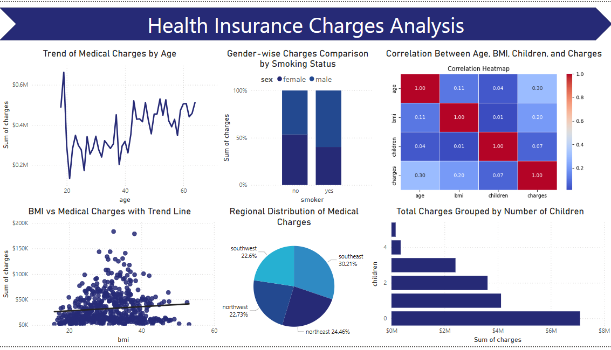
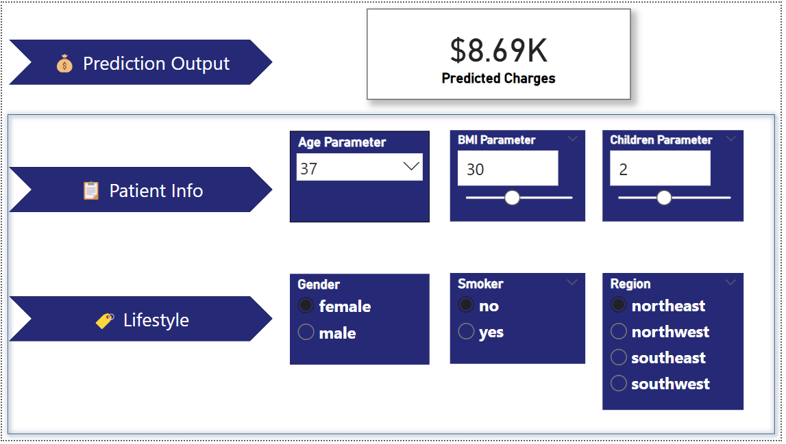

# Insurance Charges Prediction Dashboard with Power BI

This project features an interactive Power BI dashboard that visualizes and predicts insurance charges based on user input and regression modeling.

## Dataset
- Source: [Kaggle Insurance Dataset](https://www.kaggle.com/datasets/mirichoi0218/insurance)
- Features: age, gender, BMI, children, smoking status, region, charges.

## Project Overview
- One-hot encoding performed using Python script in Power BI.
- Model: Linear Regression to extract feature coefficients and intercept.
- Custom DAX measures created using coefficient values for dynamic predictions.

## Visualizations
- KPI for Predicted Charges
- User input slicers: Age, BMI, Children, Gender, Smoker, Region
- Correlation heatmap via Python visual
- Trend between BMI and Charges using scatter plot
- Medical charges distribution by age, children, and region

## Tools Used
- Power BI
- Python (in Power BI scripting)
- DAX for calculations

## Screenshots

